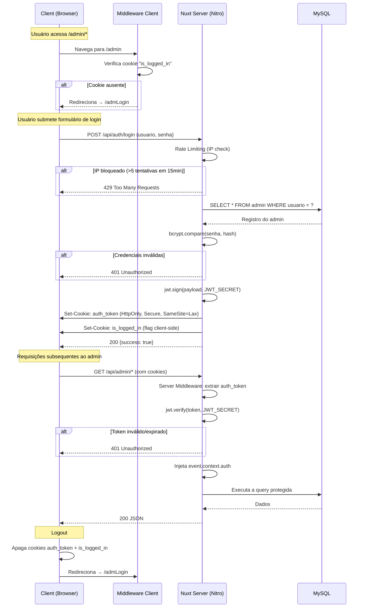

# 🌊 Wave — Portal de K-Pop & K-Drama

**Wave** é um CMS (Content Management System) fullstack para publicação e gerenciamento de notícias sobre cultura coreana (K-Pop e K-Drama). O sistema conta com um portal público para leitores e um painel administrativo protegido por autenticação JWT.

---

## 📑 Sumário

- [Stack Tecnológica](#-stack-tecnológica)
- [Arquitetura do Projeto](#-arquitetura-do-projeto)
- [Fluxo de Autenticação](#-fluxo-de-autenticação)
- [Docker (Recomendado)](#-docker-recomendado)
- [Instalação Manual (Sem Docker)](#-instalação-e-configuração)
- [Variáveis de Ambiente](#-variáveis-de-ambiente)
- [Documentação da API](#-documentação-da-api)
- [Scripts Disponíveis](#-scripts-disponíveis)
- [Funcionalidades Principais](#-funcionalidades-principais)

---

## 🛠 Stack Tecnológica

| Camada       | Tecnologia                                        |
| ------------ | ------------------------------------------------- |
| **Frontend** | Nuxt 4, Vue 3 (Composition API), TypeScript       |
| **UI**       | Tailwind CSS, PrimeVue 4 (Tema Aura), PrimeIcons  |
| **Editor**   | TipTap 3 (editor de rich text)                    |
| **Backend**  | Nitro (H3), API Routes do Nuxt                    |
| **ORM**      | Sequelize 6 (MySQL)                               |
| **Auth**     | JWT (`jsonwebtoken`) + Cookies HttpOnly            |
| **Hash**     | bcrypt (12 salt rounds)                            |
| **Upload**   | Sharp (processamento de imagens → WebP)           |
| **Validação**| Zod 4                                              |
| **Runtime**  | Node.js ≥ 18 (ESM)                                |

---

## 🏗 Arquitetura do Projeto

```
wave/
├── app.vue                      # Root component
├── nuxt.config.ts               # Configuração Nuxt + runtimeConfig
├── middleware/
│   └── auth.global.ts           # Guard client-side (proteção de rotas /admin)
├── layouts/
│   └── admin.vue                # Layout do painel administrativo
├── pages/
│   ├── index.vue                # Home pública
│   ├── sobre.vue                # Página "Sobre"
│   ├── admLogin.vue             # Tela de login
│   ├── publicacao/[id].vue      # Detalhe da notícia
│   ├── categorias/              # Listagem por categoria (kpop/kdrama)
│   ├── tags/                    # Listagem por tag (kpop/kdrama)
│   └── admin/                   # Painel administrativo (CRUD completo)
│       ├── noticias/            # Gerenciar notícias
│       ├── categorias/          # Gerenciar categorias
│       ├── tags/                # Gerenciar tags
│       └── autores/             # Gerenciar autores
├── server/
│   ├── api/
│   │   ├── auth/login.post.ts   # Endpoint de autenticação
│   │   ├── admin/               # Endpoints protegidos (CRUD)
│   │   ├── noticias/            # Endpoints públicos
│   │   ├── categorias/          # Endpoints públicos
│   │   └── tags/                # Endpoints públicos
│   ├── middleware/auth.ts       # Guard server-side (valida JWT)
│   ├── dbModels/                # Modelos Sequelize
│   ├── interface/               # Interfaces TypeScript
│   ├── plugins/database.ts      # Plugin Nitro — conexão com DB
│   ├── routes/uploads/          # Servir imagens estáticas
│   └── utils/
│       ├── auth.ts              # Constantes, rate limiting, enums HTTP
│       ├── enum.ts              # Enum TipoConteudo (KPOP/KDRAMA)
│       └── sequelize.ts         # Instância Sequelize
├── components/                  # Componentes Vue reutilizáveis
├── uploads/                     # Imagens enviadas (geradas em runtime)
└── utils/                       # Utilitários client-side
    ├── enum.ts                  # TipoConteudo + labels
    └── animations.ts            # Scroll observer para animações
```

---

## 🔐 Fluxo de Autenticação



### Camadas de Proteção

| Camada             | Arquivo                      | Função                                                                        |
| ------------------ | ---------------------------- | ------------------------------------------------------------------------------ |
| **Client Guard**   | `middleware/auth.global.ts`  | Evita flash de conteúdo admin; redireciona se `is_logged_in` ausente           |
| **Server Guard**   | `server/middleware/auth.ts`  | Valida JWT real em cada request `/api/admin/*`; injeta `event.context.auth`    |
| **Rate Limiting**  | `server/utils/auth.ts`       | Bloqueia IP após 5 tentativas de login em 15 minutos                          |
| **Cookie Security**| `login.post.ts`              | `HttpOnly`, `Secure` (prod), `SameSite=Lax`                                   |

---

## 🐳 Docker (Recomendado)

A forma mais rápida de subir o projeto inteiro (app + MySQL) com um único comando.
As **imagens de upload** e o **banco de dados** ficam em volumes Docker separados — nunca são sobrescritos por rebuild.

### Pré-requisitos

- **Docker** ≥ 20.x
- **Docker Compose** ≥ 2.x (já incluso no Docker Desktop)

### Subindo do zero (primeira vez)

```bash
# 1. Clone o repositório
git clone https://github.com/DevPauloRoberto/wave
cd wave

# 2. Crie o .env a partir do exemplo
cp .env.example .env
# Edite o .env com suas senhas (DB_PASS, JWT_SECRET, etc.)

# 3. Habilite a criação de tabelas (só na primeira vez!)
#    Abra server/plugins/database.ts e descomente:
#      await sequelize.sync({ alter: true });

# 4. Suba tudo (MySQL + App)
docker compose up -d --build

# 5. Acompanhe os logs até ver "Modelos e associações inicializados"
docker compose logs -f app

# 6. IMPORTANTE: Comente a linha do sync novamente e rebuild
#    (evita alterações acidentais no banco em deploys futuros)
docker compose up -d --build app
```

Pronto! Acesse `http://localhost:3000`.

### Comandos do dia a dia

```bash
# ── Status ────────────────────────────────────────
docker compose ps                          # Ver containers rodando
docker compose logs -f                     # Logs de tudo em tempo real
docker compose logs -f app                 # Logs só da app
docker compose logs -f db                  # Logs só do MySQL

# ── Parar / Iniciar ──────────────────────────────
docker compose stop                        # Parar (mantém dados)
docker compose start                       # Iniciar novamente
docker compose down                        # Parar e remover containers

# ── Rebuild (após alterar código) ─────────────────
docker compose up -d --build app           # Rebuild só da app (uploads e banco intactos)
docker compose up -d --build               # Rebuild de tudo

# ── Banco de dados ────────────────────────────────
docker compose exec db mysql -u wave_user -pwave_pass wave   # Acessar MySQL
docker compose exec db mysqldump -u wave_user -pwave_pass wave > backup.sql  # Backup

# ── Ver onde os volumes estão no disco ────────────
docker volume inspect wave_uploads_data
docker volume inspect wave_mysql_data

# ── CUIDADO: Comandos destrutivos ─────────────────
docker compose down -v                     # Apaga TUDO (banco + uploads)
docker volume rm wave_mysql_data           # Apaga só o banco
docker volume rm wave_uploads_data         # Apaga só os uploads
```

### Estrutura Docker

| Serviço | Container    | Porta  | Descrição                         |
| ------- | ------------ | ------ | ---------------------------------- |
| `db`    | `wave-db`    | `3306` | MySQL 8.0 com healthcheck          |
| `app`   | `wave-app`   | `3000` | Nuxt (Nitro) em produção           |

| Volume (nomeado)   | Caminho no Container | Descrição                          |
| ------------------ | -------------------- | ----------------------------------- |
| `mysql_data`       | `/var/lib/mysql`     | Dados persistentes do MySQL         |
| `uploads_data`     | `/app/uploads`       | Imagens enviadas pelo painel admin  |

> **Os volumes são gerenciados pelo Docker, fora da pasta do projeto.**
> Rebuild, clone novo, ou deletar o código **não apaga** seus dados.
> Para ver onde estão fisicamente: `docker volume inspect wave_uploads_data`

> **Nota:** O `DB_HOST` no Docker é `db` (nome do serviço no compose), não `localhost`.

> 📖 **Vai fazer deploy numa VPS?** Veja o [DEPLOY.md](DEPLOY.md) — guia completo passo a passo para a Hostinger (KVM 1).

---

## 🚀 Instalação e Configuração

> Instalação **manual**, sem Docker. Use se preferir rodar Node e MySQL diretamente.

### Pré-requisitos

- **Node.js** ≥ 18.x
- **MySQL** 8.x (ou MariaDB 10.6+)
- **Yarn** ou **npm**

### Passo a passo

```bash
# 1. Clone o repositório
git clone https://github.com/DevPauloRoberto/wave
cd wave

# 2. Instale as dependências
yarn install
# ou: npm install

# 3. Configure as variáveis de ambiente
cp .env.example .env
# Edite o .env com suas credenciais (veja seção abaixo)

# 4. Crie o banco de dados MySQL
mysql -u root -p -e "CREATE DATABASE wave_db CHARACTER SET utf8mb4 COLLATE utf8mb4_unicode_ci;"

# 5. Sincronize as tabelas (apenas na primeira vez)
# Descomente a linha abaixo em server/plugins/database.ts:
#   await sequelize.sync({ alter: true });
# Rode o servidor, e depois comente novamente.

# 6. Inicie o servidor de desenvolvimento
yarn dev
```

O servidor estará disponível em `http://localhost:3000`.

---

## 🔑 Variáveis de Ambiente

Crie um arquivo `.env` na raiz do projeto:

```env
# ── Banco de Dados ────────────────────────────────
DB_NAME=wave_db
DB_USER=root
DB_PASS=sua_senha_segura
DB_HOST=localhost

# ── Autenticação ──────────────────────────────────
JWT_SECRET=uma-chave-secreta-com-pelo-menos-64-caracteres-alfanumericos-randomicos
JWT_EXPIRES_IN=2h

# ── Ambiente ──────────────────────────────────────
NODE_ENV=development
```

> **⚠️ Importante:** Gere o `JWT_SECRET` com um comando seguro:
> ```bash
> node -e "console.log(require('crypto').randomBytes(64).toString('hex'))"
> ```

---

## 📡 Documentação da API

Todas as rotas sob `/api/admin/*` requerem autenticação via cookie JWT.

### Autenticação

| Método | Rota                | Descrição                              | Auth |
| ------ | ------------------- | -------------------------------------- | ---- |
| `POST` | `/api/auth/login`   | Autentica admin e retorna cookies JWT  | ❌   |

**Body:**
```json
{ "usuario": "admin", "senha": "123456" }
```

**Resposta (200):**
```json
{
  "success": true,
  "message": "Login realizado com sucesso!",
  "user": { "usuario": "admin" }
}
```

---

### Notícias (Público)

| Método | Rota                            | Descrição                 | Auth |
| ------ | ------------------------------- | ------------------------- | ---- |
| `GET`  | `/api/noticias`                 | Lista notícias (paginado) | ❌   |
| `GET`  | `/api/noticias/:id`             | Detalhe de uma notícia    | ❌   |
| `GET`  | `/api/noticias/categorias/:id`  | Notícias por categoria    | ❌   |
| `GET`  | `/api/noticias/tags/:id`        | Notícias por tag          | ❌   |

**Query params (listagem):** `?page=1&limit=10`

---

### Categorias e Tags (Público)

| Método | Rota               | Descrição                 | Auth |
| ------ | ------------------ | ------------------------- | ---- |
| `GET`  | `/api/categorias`  | Lista todas as categorias | ❌   |
| `GET`  | `/api/tags`        | Lista todas as tags       | ❌   |

---

### Admin — Notícias 🔒

| Método   | Rota                        | Descrição           |
| -------- | --------------------------- | ------------------- |
| `GET`    | `/api/admin/noticias`       | Lista (paginado)    |
| `POST`   | `/api/admin/noticias`       | Cria nova notícia   |
| `GET`    | `/api/admin/noticias/:id`   | Busca por ID        |
| `PUT`    | `/api/admin/noticias/:id`   | Atualiza notícia    |
| `DELETE` | `/api/admin/noticias/:id`   | Remove notícia      |

**Body (POST/PUT):**
```json
{
  "titulo": "Título da notícia",
  "subtitulo": "Subtítulo",
  "conteudo": "<p>HTML do TipTap</p>",
  "autorId": 1,
  "img": "/uploads/uuid.webp",
  "categoriaId": 1,
  "tags": [1, 2, 3]
}
```

---

### Admin — Categorias 🔒

| Método   | Rota                               | Descrição                      |
| -------- | ---------------------------------- | ------------------------------ |
| `GET`    | `/api/admin/categorias`            | Lista (paginado)               |
| `GET`    | `/api/admin/categorias/list-all`   | Lista completa (sem paginação) |
| `POST`   | `/api/admin/categorias`            | Cria categoria                 |
| `GET`    | `/api/admin/categorias/:id`        | Busca por ID                   |
| `PUT`    | `/api/admin/categorias/:id`        | Atualiza                       |
| `DELETE` | `/api/admin/categorias/:id`        | Remove                         |

**Body (POST/PUT):**
```json
{ "nome": "BTS", "tipo": 1 }
```
> `tipo`: `1` = K-Pop, `2` = K-Drama

---

### Admin — Tags 🔒

| Método   | Rota                          | Descrição        |
| -------- | ----------------------------- | ---------------- |
| `GET`    | `/api/admin/tags`             | Lista (paginado) |
| `GET`    | `/api/admin/tags/list-all`    | Lista completa   |
| `POST`   | `/api/admin/tags`             | Cria tag         |
| `GET`    | `/api/admin/tags/:id`         | Busca por ID     |
| `PUT`    | `/api/admin/tags/:id`         | Atualiza         |
| `DELETE` | `/api/admin/tags/:id`         | Remove           |

---

### Admin — Autores 🔒

| Método   | Rota                            | Descrição        |
| -------- | ------------------------------- | ---------------- |
| `GET`    | `/api/admin/autores`            | Lista (paginado) |
| `GET`    | `/api/admin/autores/list-all`   | Lista completa   |
| `POST`   | `/api/admin/autores`            | Cria autor       |
| `GET`    | `/api/admin/autores/:id`        | Busca por ID     |
| `PUT`    | `/api/admin/autores/:id`        | Atualiza         |
| `DELETE` | `/api/admin/autores/:id`        | Remove           |

---

### Admin — Upload 🔒

| Método | Rota                    | Descrição                                |
| ------ | ----------------------- | ---------------------------------------- |
| `POST` | `/api/admin/upload`     | Upload de imagem (`multipart/form-data`) |

**Resposta (200):**
```json
{ "url": "/uploads/uuid.webp" }
```

> Imagens são automaticamente redimensionadas (max 1200px largura) e convertidas para WebP (qualidade 80).

---

## 📋 Scripts Disponíveis

| Comando            | Descrição                            |
| ------------------ | ------------------------------------ |
| `yarn dev`         | Servidor de desenvolvimento          |
| `yarn netdev`      | Dev server com `--host` (rede local) |
| `yarn build`       | Build de produção                    |
| `yarn preview`     | Preview do build de produção         |
| `yarn postinstall` | Prepara tipos Nuxt                   |

---

## ⭐ Funcionalidades Principais

- **Autenticação Admin:** Login seguro com hash bcrypt e sessão JWT via cookies HttpOnly
- **Rate Limiting:** Proteção contra brute force (5 tentativas / 15 min por IP)
- **Gestão de Notícias:** CRUD completo com editor TipTap e upload de imagem
- **Categorização:** Sistema de Categorias e Tags (Multi-select) por tipo (K-Pop / K-Drama)
- **Dashboard Responsivo:** Layout adaptável Desktop / Mobile com menu lateral
- **Tabelas Dinâmicas:** Paginação server-side e ações rápidas
- **Upload Inteligente:** Conversão automática para WebP com resize via Sharp
- **Path Traversal Protection:** Validação de caminhos no servidor de uploads

---

## 📄 Licença

Projeto privado — todos os direitos reservados.

---

Feito com 💙 usando Nuxt.
